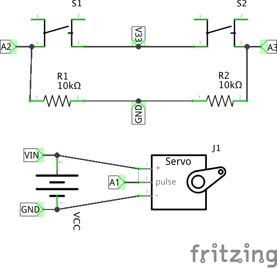
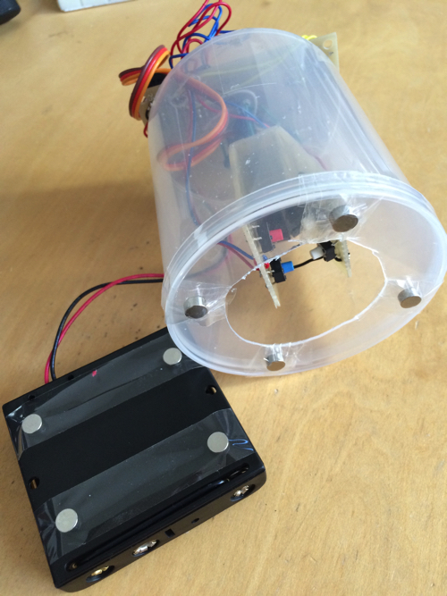
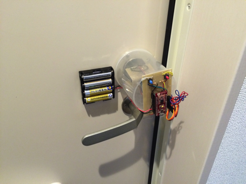
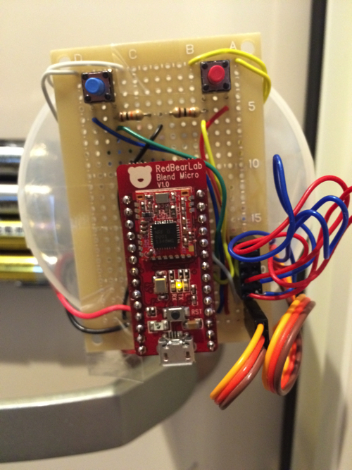
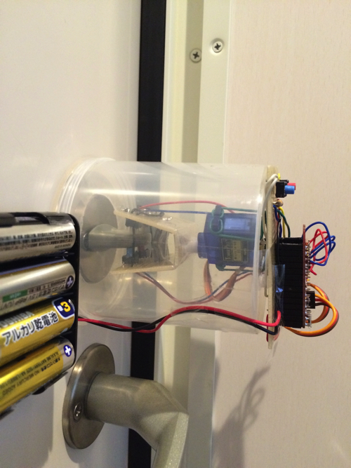
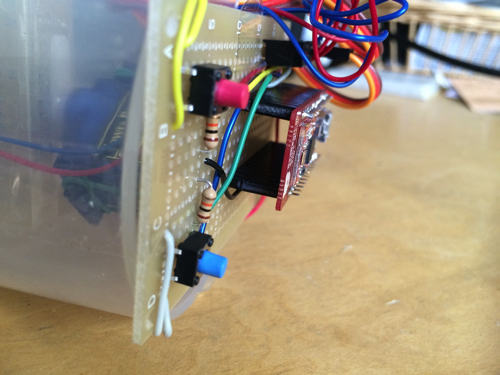
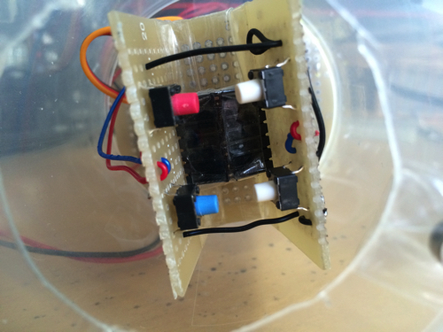
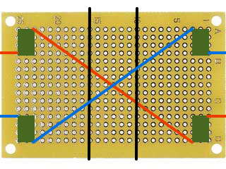

# SmartLock by Blend Micro

"SmartLock" implementation for Blend Micro (Arduino Compatible Board)

## iOS Client
https://github.com/toshi-saito/smartlock-ios-client

## Schematic

## Finished product

mounting:  

front:  

side:  

main board side:  

thumbturn:  

## Videos

## Things to prepare
[Blend Micro](http://redbearlab.com/blendmicro/)  
[カーボン抵抗 carbon resistance 10kΩ ](http://akizukidenshi.com/catalog/g/gR-25103/) x 2  
[タクトスイッチ tact switch](http://akizukidenshi.com/catalog/g/gP-03647/) x 6  
[電池ボックス 単３×４本 4xAA battery box ](http://akizukidenshi.com/catalog/g/gP-02671/) x 1  
[ユニバーサル基板 universal board ](http://akizukidenshi.com/catalog/g/gP-03229/) x 2  
[耐熱電子ワイヤー Heat-resistant electronic wire](http://akizukidenshi.com/catalog/g/gP-06756/)  
[分割ロングピンソケット pin receptacle](http://akizukidenshi.com/catalog/g/gC-05779/)  
[ピンヘッダ pin header](http://akizukidenshi.com/catalog/g/gC-00167/)  
-[サーボモータ servo SG90](http://www.amazon.co.jp/gp/product/B00I9SYEKC/ref=pd_lpo_sbs_dp_ss_1?pf_rd_p=187205609&pf_rd_s=lpo-top-stripe&pf_rd_t=201&pf_rd_i=B008YE5T8C&pf_rd_m=AN1VRQENFRJN5&pf_rd_r=0MVM8C3VFGGQ5YTQJ12Q)  
-綿棒ケース swab container x 1 （ダイソーで。）  
-ネオジム磁石 neodymium magnets（ダイソーで。）  
-セロハンテープ cellophane tape (一番出番多い。)  

## Thumbturn Knob Create Guide
use universal board  
  
黒の線に沿ってユニバーサル基板をカットしてください。  
緑はタクトスイッチです。  
赤と青は耐熱電子ワイヤーの配線です。  
基板外に出ている線(4本)はサーボモータの導線程度の長さを確保してください。  
切り取った真ん中の細長い基板に、サーボに付属している軸に取り付ける部品をセロハンテープで固定します   。
セロハンテープで切り取った基板を貼り付けてコの字型に形成します。  
内側にピンソケットなどを半田付けして、固定すると良いです。  

## TODO
* 名前募集中。
* サーボの電源が常時ONなので、MOSFET挟んで、動作時のみONにしたほうが良さげ。
* ひらけゴマ方式なので、ペアリング時にパスフレーズを生成して、EEPROMに保存。

## Links

Blend Micro  
http://redbearlab.com/blendmicro/

Arduino  
http://www.arduino.cc/

frintzing  
http://fritzing.org/home/
